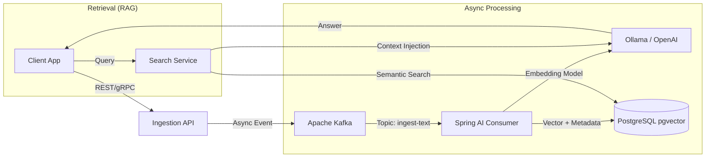

# 🧠 Memora — AI-Augmented Memory Assistant


> **“Your second brain — private, intelligent, and scalable.”**

Memora is an open-source memory augmentation platform designed to ingest, index, and retrieve human memories using **RAG (Retrieval-Augmented Generation)** architecture.

Unlike simple note-taking apps, Memora treats human memory as a high-throughput data stream, processing voice, text, and visual inputs asynchronously to build a queryable semantic vector store.

---

## 🏗️ System Architecture

Memora is built as a **Distributed Event-Driven System** to ensure scalability and decoupling between ingestion and processing.



### Key Engineering Decisions
* **Event-Driven Ingestion:** Uses **Apache Kafka** to handle high-throughput ingestion without blocking the user interface.
* **Vector Storage:** Leverages **PostgreSQL (pgvector)** to maintain transactional consistency (ACID) between metadata and vector embeddings, avoiding the complexity of a separate vector DB.
* **Abstraction Layer:** Built on **Spring AI** to swap underlying models (Ollama, OpenAI, Mistral) without code changes.

---

## 🛠️ Tech Stack

**Core Backend**
* **Language:** Java 21 (Records, Virtual Threads)
* **Framework:** Spring Boot 3.3
* **AI Integration:** Spring AI (0.8.x)

**Data & Infrastructure**
* **Streaming:** Apache Kafka (Kraft mode - Zookeeper-less)
* **Database:** PostgreSQL 16 + `pgvector` extension
* **Orchestration:** Docker Compose (Local), Kubernetes (Target)
* **Observability:** OpenTelemetry + Grafana (Planned)

---

## 🚀 Getting Started (Local Dev)

We use Docker Compose to spin up the entire infrastructure (DB, Broker, API).

### Prerequisites
* Docker & Docker Compose
* Java 21 SDK
* Maven

### Run the stack
```bash
# 1. Clone the repository
git clone [https://github.com/ton-profil/memora.git](https://github.com/ton-profil/memora.git)
cd memora

# 2. Start Infrastructure (Kafka + Postgres)
docker-compose up -d

# 3. Run the App
./mvnw spring-boot:run

```

## 🧰 Core Features (MVP)

- [x] **Async Ingestion Pipeline:** Decoupled write path via Kafka topics.
- [x] **Semantic Search:** Vector-based retrieval using Cosine Similarity.
- [ ] **Multi-Modal Support:** Audio transcription (Whisper) pipeline.
- [ ] **Privacy-First:** Support for local LLMs (Llama 3 via Ollama).

---

## 👤 Author

**Mohamed El Brik**
*Senior Software Engineer & Tech Lead @ Zenika / Decathlon*

Building scalable backends, putting Kafka in production, and exploring the intersection of distributed systems and GenAI.

[LinkedIn](https://www.linkedin.com/in/mohamed-elbrik)

---

## 📜 License

MIT License — 2025